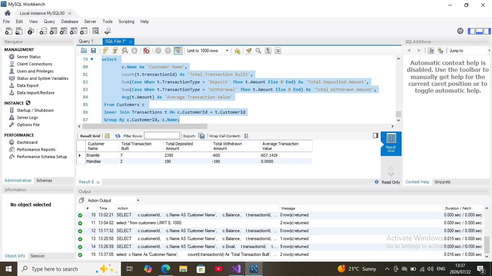
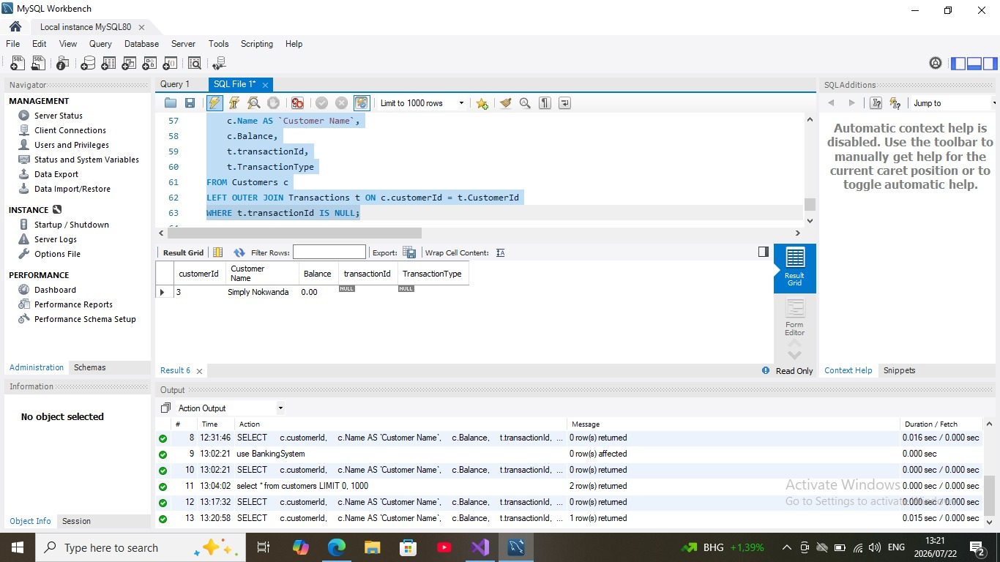
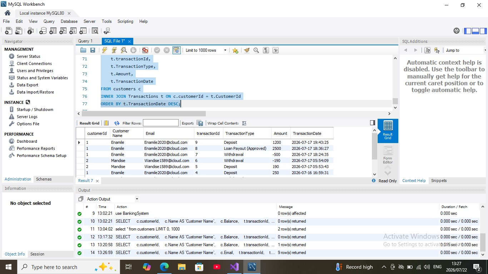

# Database Documentation

## Enterprise Banking Management System

This document provides an overview of the SQL concepts, database design and query implementations used in the Enterprise Banking Management System.

The database was designed using relational database principles to support secure and efficient banking operations including customer management, account management, loan processing and transaction management.

---

# Database Technologies

- SQL Server
- MySQL
- Entity Framework 6 (Code First)
- ASP.NET MVC 5
- C#

---

# Database Features

✔ Relational Database Design

✔ Primary & Foreign Keys

✔ Entity Relationships

✔ INNER JOIN

✔ LEFT OUTER JOIN

✔ Aggregate Functions

✔ GROUP BY

✔ Stored Procedures

✔ SQL Views

✔ Transactions

✔ Referential Integrity

---

# SQL Query Demonstrations

## 1. INNER JOIN

### Business Objective

Retrieve customer information together with their banking transactions.

This query combines records from the Customers and Transactions tables using matching Customer IDs.

### Screenshot

---

## 2. LEFT OUTER JOIN

### Business Objective

Identify customers who have not performed any banking transactions.

This query returns every customer, including those without matching transaction records.

This type of query is useful for identifying inactive customers or newly created accounts.

### Screenshot

---

## 3. GROUP BY & Aggregate Functions

### Business Objective

Generate banking summaries by grouping customer transactions.

Aggregate functions such as:

- COUNT()
- SUM()
- AVG()
- MAX()
- MIN()

were used to analyse transaction activity and produce summary reports.

### Screenshot

---

## 4. Stored Procedure

### Business Objective

Automate secure banking transactions while maintaining database consistency.

The stored procedure performs banking operations inside a transaction to ensure data integrity.

This approach prevents partial updates during deposits or withdrawals.

### Screenshot

! [Stored Procedure](docs/Images/SQL_StoredProcedure.jpeg)

---

# Database Design Principles

The database was designed using relational database best practices including:

- Normalisation
- Referential Integrity
- Primary Keys
- Foreign Keys
- Relationship Constraints
- Transaction Management

These principles help ensure data consistency, scalability and maintainability throughout the application.

---

# Learning Outcomes

Through this project I strengthened my practical understanding of:

- SQL Programming
- Database Design
- Relational Databases
- Query Optimisation
- Stored Procedures
- Banking Data Modelling
- Entity Framework
- Software Engineering Best Practices

---

# Author

**Mandise Masondo**

Graduate Software Engineer

GitHub: https://github.com/WandiseNdisoh
